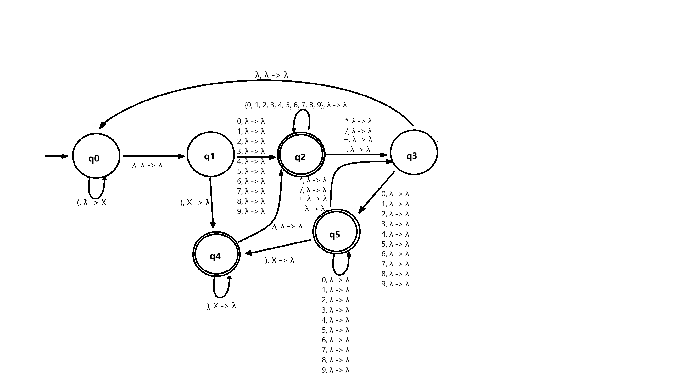

# EECS 510 Final Project 
### Designing a Formal Language, Grammar, Automata, and corresponding Data Structure

### Team Members:
+ Aiden Burke
+ Mick Torres
+ Mark Maloney

## Project Description:
### Part 1:
The explanation of the language is written in language_description.md
### Part 2:
The grammar and production rules, as well as some valid examples of strings in the language are in production_rules.md
### Part 3:
The automaton is included in the repo in PDAGraph.png, but also attached here:

### Part 4:
The data structure is defined in pda_representation.txt, and uses a similar structure to the example structure on canvas, but with an additional parameter A->B that notates what is popped (A) and pushed (B) to the stack. In the txt file, 'l' represents lambda because the lambda character had difficulty being read by the python script in part 5.

Line 1: A whitespace-separated list of states

Line 2: A whitespace-separated list of input symbols

Line 3: A whitespace-separated list of the stack symbols

Line 4: Start symbol

Line 5: A whitespace-separated list of accept states

Lines 6-60: Transitions in the form {current state} {input symbol} {stack action} {next state}
### Part 5:
The code defining the automaton is in automaton.py, which includes the functions for checking whether a string is valid in the language, which is the test_string() member method of the automaton class.

To test the code, you can run testing.py, which will auto run the test_string() function and just take user inputs of strings to test. testing.py can just be run like any python file, and will only need python to be installed and nothing else. If you want to manually type in test cases, you can import the Automaton class from automaton.py and write out test cases by initializing an automaton object and running the a.test_string(s) method.

